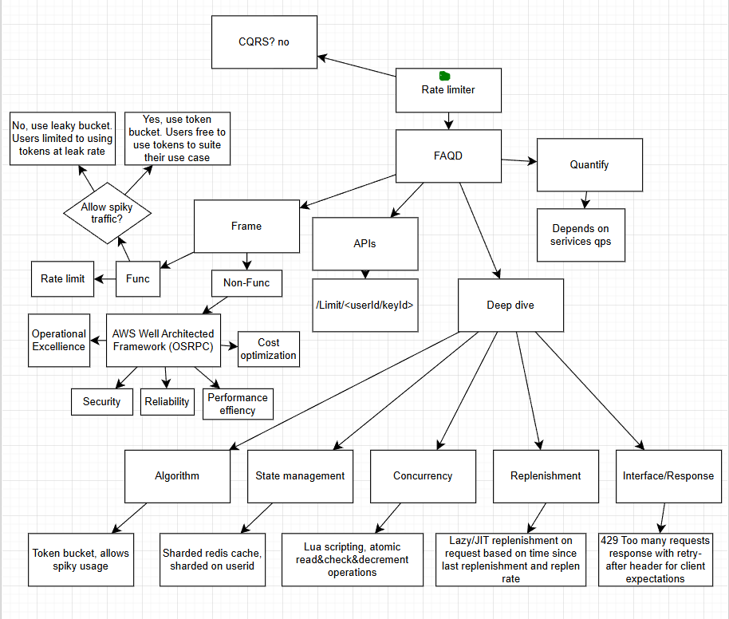

# Distributed Rate Limiter

# Cqrs?

No, in this case queries/reads of amount of tokens for user and decrement operations are tied together in the lua scripts. Only place cqrs may apply is if doing fixed replenishment, where separate workers are replenishing through a queue or kafka stream.

# Faqd

## Frame

### Func

Rate limiter needs to limit the number of requests
Should allow for spikey usage

### Non func

#### AWS Well architected framework

Operational excellence
Should limit requests well, should function well in testing, maintenance and production
Security
Should be secure, users or api limits should be handled correctly, should handle users sensitive data with care
Reliability
Should always be available to rate limit requests, should rate limit according to expected behaviours, should ensure a service level of handling 99% requests at low latency
Performance efficacy
Should only utilize necessary resources, scaling out and in according to requirements and traffic
Cost optimization
Should reduce costs as much as possible while ensuring no negative effects on services provided

## Apis

/Limit/<userId/apiKey>

## Quantify

Depends on services and type of requests such as reads or writes. Something like reads on short urls would have very high expected qps possibly 1 million, however we’d expect significantly less writes such as 10000 qps. Such estimates of qps can be used to quantify appropriate rate limits.

## Deep dive

### Algorithms

We can use token bucker to allow spiky usage. The rate limit for the set duration is enforced, however users may use all of their tokens at the end of one window and start of another window to exceed the intended rate limit, to solve this we could use a rolling window or we could introduce a replenishment rate for the bucket which acts as an additional rate limit.

### State management

We can use a sharded redis cluster to handle 100+M users. We can shard on UserId to reduce hotspots. Bucket tokens are ephemeral data so they don’t need to be stored in the db. Analytics would likely be done on the application layer after handling responses to users to ensure low response times.

### Concurrency (Atomic Operations)

To prevent race conditions between different instances of the service accessing the sharded redis cache we need to use Lua scripting in redis to ensure operations are atomic.

### Efficiency (Lazy Refill)

There’s 2 types of replenishment rates, Fixed and lazy. Fixed replenishment is where a separate service checks at an interval and replenished the bucket by a fixed amount.

Lazy or Just in time replenishment is where replenishment is done on attempted use of the service, calculation is done to dynamically replenish the bucket based on when the last replenishment happened.
For high use cases we should use lazy replenishment as that is much more efficient and scalable.

### Interface

The system returns HTTP 429 Too Many Requests with a Retry-After header to manage client expectations

# Mindmap

